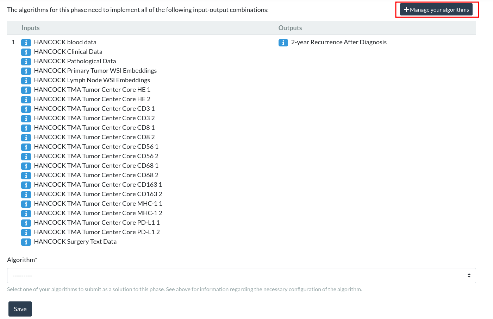
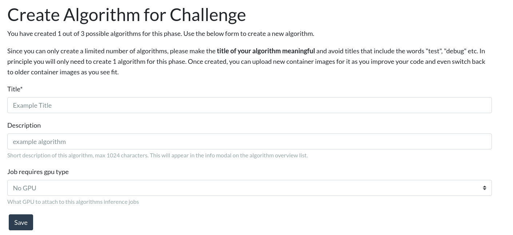
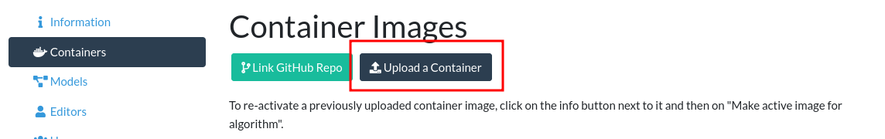
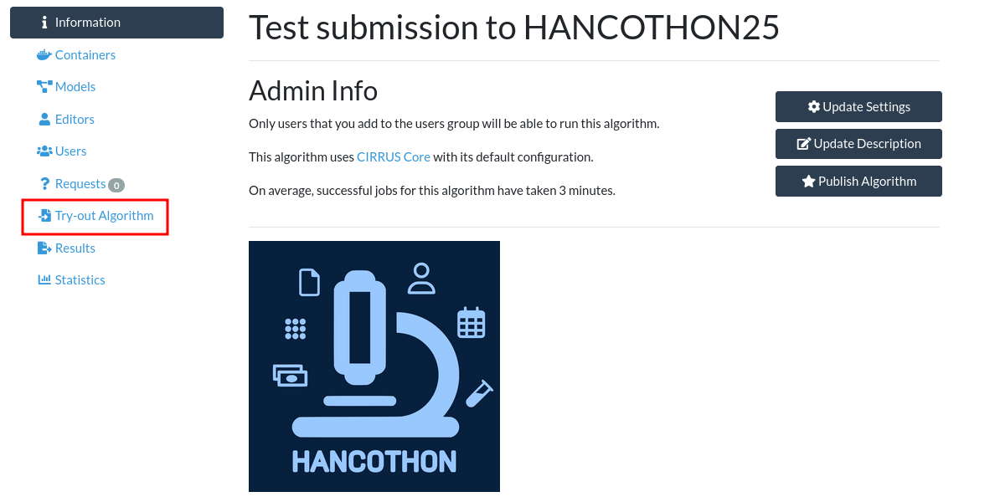
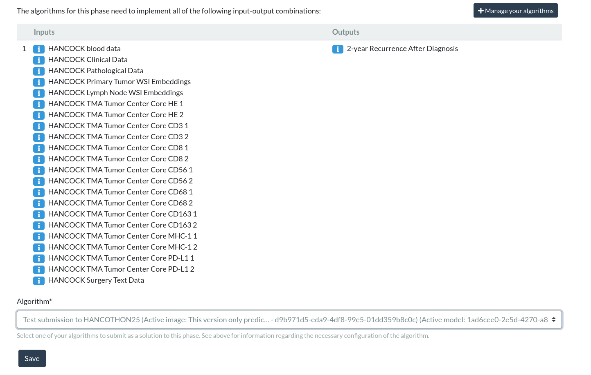

# HANCOTHON at MICCAI 2025
[Website](https://hancock.research.fau.eu/) | [Dataset download](https://hancock.research.fau.eu/download) | [Cite](#reference) | [Challenge](https://hancothon25.grand-challenge.org/) | [Slack](https://join.slack.com/t/hancothonatmiccai2025/shared_invite/zt-32ol7b80h-~Uqa0ubgplM5Fb2OkYafLA)


This repository contains code to ease the process of submitting to the Hackathon for Head and Neck Cancer at MICCAI 2025 (HANCOTHON25) on [Grand Challenge](https://hancothon25.grand-challenge.org/). The goal of this Hackathon is to predict 2-year recurrence and 5-year recurrence. The following modalities can be used for your algorithm:
- Structured Blood Data
- Structured Pathology Data
- Structured Clinical Data without the target-related columns
- Text Data in English
- Pre-extracted tumor center cores from tissue microarrays
- Pre-extracted embeddings of the primary tumor whole slide images generated with UNI
- Pre-extracted embeddings of the lymph node whole slide images generated with UNI

The training of your algorithm should be done on by your own. The training data is publicly available on our [website](https://hancock.research.fau.eu/download). Your algorithm will be evaluated on [Grand Challenge](https://hancothon25.grand-challenge.org/). To do this you will have to integrate your algorithm in a docker container. To ease this process of you, we provide this repository with a template where you can rather easy integrated your solution. In case of questions or comments please join us on [Slack](https://join.slack.com/t/hancothonatmiccai2025/shared_invite/zt-32ol7b80h-~Uqa0ubgplM5Fb2OkYafLA).

If you are interested in multimodal machine learning and want to work on a patient centered medical dataset than this is a great opportunity for you. 

## Table of Content
- [Grand Challenge Setup](#grand-challenge-setup)
- [Data](#data)
- [Submission](#submission)
- [Reference](#reference)

## Grand Challenge Setup
On Grand Challenge, you will be faced with four different phases for the two different tasks. For either of the tasks, there is an Open Development Phase and a Closed Testing Phase. The Open Development Phase should be used for testing if your algorithm is setup properly. We allow up to 10 submissions to these phases. 

### Open Development Phase
The Open Development Phases are intended for you to check if your algorithm performs properly within the Grand Challenge System. It will only be executed on 5 patients from the training dataset, so there is a high chance that the achieved score may not generalize to the Closed Testing Phase. The patients used during this phase are the following:
- [Patient 001](https://hancock.research.fau.eu/explore?patient=1)
- [Patient 002](https://hancock.research.fau.eu/explore?patient=2)
- [Patient 006](https://hancock.research.fau.eu/explore?patient=6)
- [Patient 012](https://hancock.research.fau.eu/explore?patient=12)
- [Patient 016](https://hancock.research.fau.eu/explore?patient=16)

We selected them based on their completeness for the usable modalities of the challenge. For further information on the single modalities and their accessibility, please check the [data](#data) chapter.

Once your algorithm works and you are certain that you want to submit your solution, you can move on to submit to the Closed Testing Phase.

### Closed Testing Phase
The Closed Testing Phases are the submissions that count for the final evaluation and will be evaluated for the prizes. You can only submit a **single** algorithm. So make sure that everything works properly. 
These phases will use unseen and unpublished new data that is setup in the same way as in the already publicly available [HANCOCK dataset](https://hancock.research.fau.eu/).

## Data
The data in the challenge is slightly adjusted in comparison to the available data on our download [page](https://hancock.research.fau.eu/download). This is due to the fact that Grand Challenge does not support certain data formats. In the example algorithm we have already prepared the reading of the data sources for you, but nevertheless, there are some things to consider. 

### Clinical-Data
- Download Link: https://data.fau.de/public/24/87/322108724/StructuredData.zip
- Data Format: JSON
- Data Schema: [hancothon_clinical_data_schema.json](./hancothon_schema/hancothon_clinical_data_schema.json) 
- Explanation of individual columns: https://hancock.research.fau.eu/terminology
- Availability: Complete

The clinical data can be downloaded as part of the [Structured Data](https://data.fau.de/public/24/87/322108724/StructuredData.zip). During the challenge, you only receive a dictionary JSON. This is different in comparison to the test data, here all patients are in an array format. In the challenge, the clinical data will look like this:
``` json
{
    "patient_id": "001",
    "year_of_initial_diagnosis": 2015,
    "age_at_initial_diagnosis": 65,
    "sex": "male",
    "smoking_status": "former",
    "primarily_metastasis": "no",
    "days_to_last_information": 2258,
    "first_treatment_intent": "curative",
    "first_treatment_modality": "local surgery",
    "days_to_first_treatment": 28,
    "adjuvant_treatment_intent": "curative",
    "adjuvant_radiotherapy": "yes",
    "adjuvant_radiotherapy_modality": "percutaneous radiotherapy",
    "adjuvant_systemic_therapy": "yes",
    "adjuvant_systemic_therapy_modality": "fluorouracil + cisplatin",
    "adjuvant_radiochemotherapy": "yes"
}
```

> [!warning]
> This means you will not have access to the following columns:
> - `survival_status`, `survival_status_with_cause`
> - `recurrence`, `days_to_recurrence`
> - `progress_{n}`, `days_to_progress_{n}`
> - `metastasis_{n}_locations`, `days_to_metastasis_{n}` 
> 
> Please consider this for training your model. 

### Pathological Data
- Download Link: https://data.fau.de/public/24/87/322108724/StructuredData.zip
- Data Format: JSON
- Data Schema: [hancothon_patho_data_schema.json](./hancothon_schema/hancothon_patho_data_schema.json) 
- Explanation of individual columns: https://hancock.research.fau.eu/terminologyA
- Availability: Complete

The pathological data can be downloaded as part of the [Structured Data](https://data.fau.de/public/24/87/322108724/StructuredData.zip). During the challenge, you only receive a dictionary JSON. This is different in comparison to the test data, where all patients are in an array format. In the challenge, the pathological data will look like this:
``` json
{
    "patient_id": "001",
    "primary_tumor_site": "Hypopharynx",
    "pT_stage": "pT4a",
    "pN_stage": "pN2b",
    "grading": "G3",
    "hpv_association_p16": "not_tested",
    "number_of_positive_lymph_nodes": 3.0,
    "number_of_resected_lymph_nodes": 61,
    "perinodal_invasion": "yes",
    "lymphovascular_invasion_L": "yes",
    "vascular_invasion_V": "no",
    "perineural_invasion_Pn": "no",
    "resection_status": "R0",
    "resection_status_carcinoma_in_situ": "CIS Absent",
    "carcinoma_in_situ": "no",
    "closest_resection_margin_in_cm": "<0.1",
    "histologic_type": "SCC_Basaloid",
    "infiltration_depth_in_mm": 19.0
}
```

### Blood Data
- Download Link: https://data.fau.de/public/24/87/322108724/StructuredData.zip
- Data Format: JSON
- Data Schema: [hancothon_blood_data_schema.json](./hancothon_schema/hancothon_blood_data_schema.json) 
- Explanation of individual columns: https://hancock.research.fau.eu/terminology
- Availability: Complete

The blood data can be downloaded as part of the [Structured Data](https://data.fau.de/public/24/87/322108724/StructuredData.zip). The blood data is in an array format. Each entry in the array will correspond to a single blood value. Each blood value then has the columns:
- `patient_id`: Identifier of the patient 
- `value`: The measured value
- `analyte_name`: Short name of the analyte
- `LOINC_code`: Logical Observation Identifiers Names and Codes
- `LOINC_name`: LOINC Long Common Name
- `group`: Analyte group
- `days_before_first_treatment`: Number of days before the surgery, i.e., 0 corresponds to the surgery day, and 1 corresponds to one day before the surgery

In the challenge, the pathological data will look like this:
``` json
[
  {
    "patient_id": "001",
    "value": 0.8899999857,
    "unit": null,
    "analyte_name": "INR",
    "LOINC_code": "34714-6",
    "LOINC_name": "INR in Blood by Coagulation assay",
    "group": "Routine",
    "days_before_first_treatment": 0
  },
  {
    "patient_id": "001",
    "value": 1.2599999905,
    "unit": "x10^3/µl",
    "analyte_name": "Lymphocytes",
    "LOINC_code": "26474-7",
    "LOINC_name": "Lymphocytes [#/volume] in Blood",
    "group": "Hematology",
    "days_before_first_treatment": 0
  },
  {
    "patient_id": "001",
    "value": 0.8999999762,
    "unit": "%",
    "analyte_name": "Eosinophils %",
    "LOINC_code": "26450-7",
    "LOINC_name": "Eosinophils/100 leukocytes in Blood",
    "group": "Hematology",
    "days_before_first_treatment": 0
  }
]
```

### Text Data in English
- Download Link: https://data.fau.de/public/24/87/322108724/TextData.zip
- Data Format: JSON
- Data Schema: [hancothon_text_data_schema.json](./hancothon_schema/hancothon_text_data_schema.json) 
- Availability: Incomplete

The text data in English can be downloaded as part of the [Text Data](https://data.fau.de/public/24/87/322108724/TextData.zip). In the challenge, this will be a single JSON file with a dictionary structure. The available columns are:
- `patient_id`: Identifier of the patient
- `history`: Medical histories
- `report`: Report of the surgery
- `description`: Short description of the surgery

In the challenge, the text data will look like this:
``` json
{
    "patient_id": "001",
    "history": "In the patient, a G3-differentiated cT3 hypopharyngeal laryngeal carcinoma of the right side was histologically confirmed <2015>. Clinically as well as sonographically and computed tomography cT3 cN2b. In addition, nodular goiter on both sides with nodes > 2 cm each. All common tumor options (surgery versus primary radiochemotherapy) were discussed in detail with the patient in advance. There is now an indication for surgical treatment in the form of a laryngectomy with partial pharyngectomy, neck dissection on both sides and hemi-thyroidectomy. The patient had ample opportunity to ask questions about the procedure before the operation.",
    "report": "After active patient identification, the patient is brought into the operating theater. Carrying out the team time-out. Introductory consultation with the anesthesia department. Induction of anesthesia and orotracheal intubation of the patient. Initial positioning of the patient by the surgeon. First, a new panendoscopy is performed to plan the surgical procedure. Insertion of the mouth guard and insertion of the size C small bore tube. This confirms the size expansion described above. Subsequent placement of a nasogastric feeding tube without any problems. Positioning of the patient in head reclination. Superficial skin disinfection. Infiltration anesthesia with a total of 15 ml xylocaine with adrenaline added in the area of the incision for the planned apron flap. Subsequent ablation of the surgical area and sterile draping. First mark the planned incision. Skin incision and lifting of a broad-based apron flap, with strictly subplatysmal preparation. Insertion of the chain dog. First start of neck dissection on the right side. Exposure of the sternocleidomastoid muscle and the omohyoid muscle as the caudal border and the posterior digastric venter muscle as the cranial border. Expose the capsule of the submandibular gland. Turning to the cervical vascular sheath. Exposure of the internal jugular vein and the venous angle including protection of the facial vein. Exposure of the common carotid artery, the bifurcation and the internal and external carotid artery. Exposure of the accessorius nerve and the hypoglossal nerve. The cervical artery cannot be spared intraoperatively. An extensive metastatic conglomerate can now be seen in levels II and III up to just before level IV, which appears to be firmly attached to the surrounding area. The soft tissue metastasis can only be separated from the internal jugular vein with difficulty. The metastatic conglomerate extends very far medially and reaches the vagus nerve. Therefore, first relocation, neurolysis and re-embedding of the vagus nerve. This can be spared. Intraoperatively, the border cord appears to be firmly attached to the metastatic conglomerate. First develop the lateral neck preparation, whereby the cervical plexus branches can largely be spared here. Turn to the medial neck preparation. The hypoglossal nerve is also exposed here. Displacement, neurolysis and re-embedding of the hypoglossal nerve. Protection of the nerve. Successive development of the medial neck preparation. Moving on to the left side: the same procedure in principle here. First expose the sternocleidomastoid muscle and the omohyoid muscle as the caudal border and the posterior digastric venter muscle as the cranial border. Turning to the cervical vascular sheath. Exposure of the internal jugular vein from the caudal to the cranial border. Exposure of the facial vein and protection of the same. Exposure of the common carotid artery, the bifurcation and the internal and external carotid artery. Exposure of the accessorius nerve, displacement, neurolysis and re-embedding of the same. Protection of the nerve. Development of the lateral neck preparation while sparing the cervical plexus branches. Exposure of the submandibular gland capsule and the hypoglossal nerve. Displacement, neurolysis and re-embedding of the nerve. Development of the medial neck preparation. Transition to visualization of the hypoid. Subsequent separation of the infrahyoid muscles using the electric knife. The sternohyoid muscle is cut caudally. Then supply the upper laryngeal bundle on both sides. Exposure of the thyroid cartilage horn on the left side. Incision of the perichondrium and release of the left-sided piriform sinus with the raspatory as well as with the pedicle swab. Subsequent exposure of the trachea and the thyroid isthmus. Dissection of the isthmus and repositioning of the isthmus. Exposure, displacement, neurolysis and re-embedding of the vagus nerve. This shows the large thyroid nodus described by sonography and computed tomography. Due to the prominent left-sided thyroid lobe and the slightly suspicious intraoperative appearance of the nodule, the decision was made to perform a hemithyroidectomy on the left side. Care is taken to preserve the epithelial bodies. The ventral trachea is then exposed. Proceed to the tracheotomy. Enter below the 1st tracheal clasp and transfer to an LE tube. Then open the pharynx infrahyoidally in the median line. Expose the upper edge of the epiglottis. Grasp the epiglottis and dislocate it through a relatively small pharyngotomy. You now have a good view of the extent of the tumor. First start resection in the area of the left-sided aryepiglottic fold. Mucosa-sparing incision up to just before the arytenoid cartilage. Then widen the incision caudally and in the area of the postcricoid. Hemostasis of several small bleedings from the laryngopharyngeal plexus. Subsequent counter-preparation from the left side. Here, too, the incision is made in the area of the aryepiglottic fold, whereby this is extended into the pharynx due to the tumor extension into the right-sided piriform sinus. In between, further release of the laryngeal skeleton with the attached soft tissue cuff. Deposition of the trachea at the level of the 1st tracheal cartilage and resection of the larynx and the right-sided piriform sinus in toto. The specimen is sent in thread-marked for definitive histology. Meticulous inspection of the tumor specimen and subsequent removal of corresponding marginal samples, which are sent for intraoperative frozen section diagnostics. In the meantime, meticulous hemostasis. Announcement of the intraoperative frozen section diagnosis: This shows a tumor-free resection margin, which is why an R0 situation can be assumed intraoperatively. Perform a rather restrained myotomy in the area of the upper esophageal sphincter so as not to provoke reflux problems postoperatively. The placement of a Provox prosthesis is deliberately avoided for the time being due to the relatively narrow remaining pharyngeal tube. Dissection of the left-sided sternal part of the sternocleidomastoid muscle. This results in slightly more severe venous bleeding, which can be stopped with the aid of three inversion stitches. Then perform the inverting pharyngeal suture with Vicryl 3.0 RB-1 using the single-button suture technique. This is performed in a T-shaped configuration. Extremely meticulous work is carried out at the base of the tongue and caudally at the level of the stoma in order to further reduce the risk of fistula formation at these predilection sites. Grasping the lateral musculature and suturing it using a continuous overlocking suture technique in the sense of a second layer. Application of a layer of TachoSil. Grasping of the remaining peripheral soft tissue, which is additionally stitched over the pharyngeal suture as a fourth layer. The sternohyoid muscle, which has previously been folded caudally, is also stitched over the wound bed. Then irrigate the wound with H2O2 and Ringer's solution. Insertion of two 10-gauge Redon drains and circular epithelialization of the tracheostoma. Subcutaneous suturing with Vicryl 4.0 and skin suturing with Ethilon 5.0. Application of a pressure dressing and transfer of the patient to a 10-gauge high-volume low-pressure cannula. Completion of the procedure without complications. Final consultation with the anesthesia department. The patient received 3 g Unacid i.v. intraoperatively. Antibiotics should be continued postoperatively for five days.",
    "description": "TU resection, Neck dissection bilateral\n"
}

```

This is only partially available. Therefore, the text data can be `null`. Please consider this during training. 

### Pre-Extracted Tumor Center Cores from Tissue Microarrays
> [!NOTE]
> This is a 196 GB file. Make sure you have the resources available for this download.

- Download Link: https://hancock.research.fau.eu/public/assets/TMA_TumorCenter_Cores.zip
- Data Format: MetaImage File Format (MHA)
- Availability: Incomplete

The pre-extracted Tumor Center Cores from Tissue Micrarrays (TMA Cores) can be downloaded [here](https://hancock.research.fau.eu/public/assets/TMA_TumorCenter_Cores.zip). But please make sure before you download that you have at least 196 GB free storage and, depending on your internet connection also some time available. 

In the challenge, the TMA Cores are in MHA format. But in the `example-algorithm` we already extract the cores with the python library  [SimpleITK](https://pypi.org/project/simpleitk/) into array format. 

There are at most 8 different staining available. During the challenge, each staining is at most 2 times available. This totals to a maximum of 16 TMA Cores. The potentially available stainings are (for):
- Hematoxylin and Eosin (HE)
- Cluster of Differentiation (CD) 3
- CD8
- CD56
- CD68
- CD163
- Major Histocompatibility Complex class I (MHC-1)
- Programmed death-ligand 1 (PD-L1)

> [!warning]
> For each patient, there will be at most 16 cores, but there might be cases where there are not entirely available. In these cases, you will receive an image with only a single pixel. Please consider this during training.

### Pre-Extracted Embeddings of Whole Slide Images generated with UNI
- Download Link: https://hancock.research.fau.eu/public/assets/WSI_UNI_encodings.zip
- Data Format: JSON
- Data Schema: [hancothon_wsi_data_schema.json](./hancothon_schema/hancothon_wsi_data_schema.json) 
- Availability: Incomplete

The pre-extracted embeddings of the primary tumor and lymph node whole slide images can be downloaded [here](https://data.fau.de/public/assets/WSI_UNI_encodings.zip). It contains the UNI embeddings on patch-level for the Whole Slide Images with a patch size of 2048 x 2048 pixels. If you do not know UNI yet, we recommend you to read this [paper](https://doi.org/10.1038/s41591-024-02857-3). 

The HP5 container you can download on the [HANCOCK website](https://data.fau.de/public/assets/WSI_UNI_encodings.zip) contains, as well as the JSON file that you will be provided during the challenge, the following keys:
- `features` (list[list[float]]): The features from the all patches that were segmented from the WSI. Every array in the base array relates to the embeddings of a single patch.
- `coords` (list[list[tuple[int, int]]]): Contains for each patch the coordinates where they have been extracted from on the original whole slide image. 

The JSON for the challenge will be constructed like this:
``` json
{
    "features": [
        [  
            -2.6923696994781494,
            2.5603489875793457,
            -0.4249601662158966,
            -1.039771556854248,
            0.43003350496292114,
            0.7976626753807068,
            0.8344122171401978,
            -1.220271348953247,
            -0.5300487875938416,
            0.1353420913219452,
            1.3537638187408447,
            1.3043394088745117
        ]
    ],
    "coords": [
        [
            10000,
            115728
        ]
    ]
}
```

> [!warning]
> The lymph node slides will not be available for all patients in the test set. In this cases the JSON file will have empty entries for the `features` and `coords` keys. 

### Download all Data
We received feedback that the download process on our [web page](https://hancock.research.fau.eu/download) can be frustrating. To make your life a little easier, you can use this bash script to curl the necessary data all at once. Please be aware that this script will not check your available storage and does not provide any error handling. 

``` bash
base_download_url="https://data.fau.de/public/24/87/322108724/"

file_names=(
  "StructuredData.zip"              # Challenge relevant
  "TextData.zip"                    # Challenge relevant
  # "DataSplits_DataDictionaries.zip" # Not needed for the challenge
  # "TMA_TumorCenter.zip"             # Not needed for the challenge
  # "TMA_InvasionFront.zip"           # Not needed for the challenge
  # "TMA_Maps.zip"                    # Not needed for the challenge
  # "TMA_CellDensityMeasurements.zip" # Not needed for the challenge
  # "WSI_PrimaryTumor_Oropharynx_Part1.zip" # Not needed for the challenge
  # "WSI_PrimaryTumor_Oropharynx_Part2.zip" # Not needed for the challenge
  # "WSI_PrimaryTumor_OralCavity.zip"       # Not needed for the challenge
  # "WSI_PrimaryTumor_Larynx.zip"           # Not needed for the challenge
  # "WSI_PrimaryTumor_Hypopharynx.zip"      # Not needed for the challenge
  # "WSI_PrimaryTumor_CUP.zip"              # Not needed for the challenge
  # "WSI_PrimaryTumor_Annotations.zip"      # Not needed for the challenge
  # "WSI_LymphNode.zip"                     # Not needed for the challenge
)

for file_name in "${file_names[@]}"
do 
  download_url="$base_download_url$file_name"
  echo "Try to download file $file_name from $download_url"
  wget $download_url
  echo "Unzipping $file_name"
  unzip $file_name
  echo "Removing $file_name"
  rm $file_name
  echo -e "\n\n"
done

base_download_url="https://hancock.research.fau.eu/public/assets/"
file_names=(
  "TMA_TumorCenter_Cores.zip"             # Challenge relevant
  "WSI_UNI_encodings.zip"                 # Challenge relevant
)
for file_name in "${file_names[@]}"
do 
  download_url="$base_download_url$file_name"
  echo "Try to download file $file_name from $download_url"
  wget $download_url
  echo "Unzipping $file_name"
  unzip $file_name
  echo "Removing $file_name"
  rm $file_name
  echo -e "\n\n"
done
```

## Submission
The submission process for each task and phase is the same. For each of them you will have to alter the [example-algorithm](./example-algorithm) directory of this repository. The directory has the following structure:

```
example-algorithm
|
├── model                # Directory for resources that frequently change.
├── resources            # Directory for resources.
├── test                 # Contains example data for input and output.
|   ├── input
|   └── output
├── do_build.sh          # Helper script to build the Docker container
├── do_save.sh           # Saves the docker image as .tar.gz for upload
├── do_test_run.sh       # Runs the container on local device
├── Dockerfile           # Defines the docker image and calls inference.py
├── inference.py         # Script to execute your algorithm
└── requirements.txt     # Requirements of your algorithm
```

In short you need to include your personal solution in the `inference.py` script and then run `do_save.sh` to create the compressed archive that you then upload on Grand Challenge for the respective task. First to the Open Development Phase to know that everything is configured right and then if you are happy with your results a **single** time to the Closed Development Phase. 

In the following we will talk you through in a little bit more depth through this process. 

### Requirements
This repository and the following instructions require you to execute bash scripts and run [Docker](https://www.docker.com/J) on your device. It should be possible to rewrite the bash scripts into PowerShell scripts and use for example [Podman](https://podman.io/) instead of [Docker](https://www.docker.com/). If you are able to do so, we would appreciate your feedback and a PR, but we do not have the resources to support you with this. Therefore, if you have to use a Window's device, we recommend to use [Windows Subsystem for Linux (WSL)](https://learn.microsoft.com/en-us/windows/wsl/about)

With this said we assume these things given: 
- Installed [Docker](https://www.docker.com/)
- Bash compatible shell

### Execute the Example
Before we dive into the changing of any files, we recommend that you check if you can execute our simple example, to check if everything is installed correct. 

**Execute without Docker**
First we going to execute `inference.py` without Docker to get you familiar with the execution and behavior of the script. 

*Optional*: Create a new virtual environment or conda environment e.g.
``` bash
conda create -n hancothon python=3.11
conda activate hancothon
```

1. Change into the directory and install the requirements needed for the initial execution
``` bash
cd example-algorithm
pip install -r requirments.txt
```

2. Execute the `inference.py` script:
``` bash
python inference.py
```

Now let us take a look about the output of the script and break it down:
```
=+==+==+==+==+==+==+==+==+==+=
Collecting Torch CUDA information
Torch CUDA is available: True
        number of devices: 1
        current device: 0
        properties: _CudaDeviceProperties(name='NVIDIA RTX A5000', major=8, minor=6, total_memory=24114MB, multi_processor_count=64, uuid=764beb20-aff9-1954-c3b7-be474af54a47, L2_cache_size=6MB)
=+==+==+==+==+==+==+==+==+==+=

# Inside resources/some_resource.txt
This might be some resource you would require to do a forward pass.
For instance: some weights for your model.

Your prediction is: recurrence

```

The first block is related to your device hardware. If you have a CUDA compatible GPU it should show up in this section. If you do not have the hardware, do not worry, on Grand Challenge you can later select if you want to use a GPU or not. This output is only important if you think it should show a device and it does not. If this is the case please check if your hardware is running and consider reinstalling the drivers. But you will not need this to work at least to follow along with this tutorial. 

The second block shows that the script successfully imported a text file from the resources directory where you later can place e.g. your model weights.

The last line is your first prediction for the HANCOTHON. Congratulations. 

Now let us check if the results was also saved properly. Therefore, perform the following command from the example-algorithm directory.
``` bash
cat test/output/interf0/2-year-recurrence.json
```

If this outputs: `"recurrence"%` the saving of your prediction was also successful. 

**Execute with Docker**
Now we want to check if this also works in conjunction with Docker. Therefore, if you already created an output previously perform first this command from within the `example-algorithm` directory.
``` bash
rm -r test/output
```

Now let us execute the script in a freshly created Docker Image with this command:
``` bash
./do_test_run.sh
```

This is a truncated output of this command:
```
=+= (Re)build the container
DEPRECATED: The legacy builder is deprecated and will be removed in a future release.
            Install the buildx component to build images with BuildKit:
            https://docs.docker.com/go/buildx/

Sending build context to Docker daemon  4.191GB
Step 1/10 : FROM --platform=linux/amd64 pytorch/pytorch AS example-algorithm-amd64
Step 2/10 : ENV PYTHONUNBUFFERED=1
Step 3/10 : RUN groupadd -r user && useradd -m --no-log-init -r -g user user
Step 4/10 : USER user
Step 5/10 : WORKDIR /opt/app
Step 6/10 : COPY --chown=user:user requirements.txt /opt/app/
Step 7/10 : COPY --chown=user:user resources /opt/app/resources
Step 8/10 : RUN python -m pip install     --user     --no-cache-dir     --no-color     --requirement /opt/app/requirements.txt
Step 9/10 : COPY --chown=user:user inference.py /opt/app/
Step 10/10 : ENTRYPOINT ["python", "inference.py"]

Successfully tagged example-algorithm-open-development-phase:latest
=+= Doing a forward pass on interf0
=+==+==+==+==+==+==+==+==+==+=
Collecting Torch CUDA information
Torch CUDA is available: True
        number of devices: 1
        current device: 0
        properties: _CudaDeviceProperties(name='NVIDIA RTX A5000', major=8, minor=6, total_memory=24114MB, multi_processor_count=64, uuid=764beb20-aff9-1954-c3b7-be474af54a47, L2_cache_size=6MB)
=+==+==+==+==+==+==+==+==+==+=

# Inside resources/some_resource.txt
This might be some resource you would require to do a forward pass.
For instance: some weights for your model.

Your prediction is: recurrence
=+= Wrote results to .../HANCOTHON25/example-algorithm/test/output/interf0
=+= Save this image for uploading via ./do_save.sh
=+= Cleaning permissions ...
```

The first 10 steps are the commands from the `Dockerfile`. It creates the Docker Image including the installation of the required python libraries from the `requirements.txt`. Then it calls the `inference.py` in the same way we did previously but this time from within the docker container. 
This means if everything worked properly the bottom half of the output starting with the information about your CUDA compatible hardware should be equivalent to your previous output. 

If your CUDA device is not recognized you might have to install additional software such as the [NVIDIA Container Toolkit](https://docs.nvidia.com/datacenter/cloud-native/container-toolkit/latest/install-guide.html). But again for this tutorial you do not need to have CUDA available. 

Now you can again check if the result was saved with this command:
``` bash
cat test/output/interf0/2-year-recurrence.json
```

If this outputs: `"recurrence"%` the saving of your prediction was successful. 

### Change the Prediction Task
Now we want to touch `inference.py` script the first time. For this please open it in your preferred IDE. We will refer to line numbers in the following, so it would be helpful if your IDE also shows this. 

To ease the process of changing the prediction task from 2-year recurrence to 5-year survival and vice versa, we prepared the global variable `PREDICTION_TARGET_SLUG`. This determines the string that should be returned by your algorithm (function [prediction_to_string](./example-algorithm/inference.py#L295-L313) line 295-313). This variable should either have the value `"5-year survival"` or `"2-year-recurrence-after-diagnosis"`. We prepared both values for you at [Line 50 and 51](./example-algorithm/inference.py#L50-L51). You can just set this global to the prediction target you are currently working on. 

You can test this by commenting line 50 and un-commenting line 51 and run again:
``` bash
python inference.py
```

The output prediction should now be visible with this command:
``` bash
cat test/output/interf0/5-year-survival.json
```

This should return `"deceased"%`. Notice that not only the predicted label but also the path of the output file has changed.  
### Insert your Algorithm
Now we are going to change the prediction and along the way take a look at the `inference.py` structure.

If we want to change the behavior of the algorithm we have to take a look into the [interf0_handler](./example-algorithm/inference.py#L94-L187) function. In the [first section](./example-algorithm/inference.py#L95-L161) the input data is loaded into your script. We recommend to not change the loading mechanism, but you can of curse rename the corresponding variables. 

Then in [line 164](./example-algorithm/inference.py#L164) we find the call of the function that displays the available CUDA compatible hardware, followed by the loading of the example text file from the `resources` directory. This directory is the location where you can store your model weights etc. that will not change in the future or only, when the complete algorithm has to be replaced. If you are expecting that your resource will change, than consider placing it in the `model` directory. This has to be uploaded separately, what is inconvenient the first time, but then has the advantage that you can replace the content independent from your algorithm. 

> [!important]
> In [line 170 to 173](./example-algorithm/inference.py#L170-L173) we find the prediction logic. In our case independent from the input we will predict 1.0 what corresponds to either "recurrence" or "deceased" depending on the prediction target. 
> Here you should place your algorithm that handles the input data. 

The remaining code converts your prediction from a float into a string and saves it to the right location. The mapping is the following:
**2-year recurrence**:
- greater threshold: "recurrence"
- <= threshold: "no recurrence"

**5-year survival**:
- greater threshold: "deceased"
- <= threshold: "living"

Please be aware that only these labels are accepted. If you alter the functions that provide these mapping make sure that you do not by mistake insert a type because then your prediction will always be evaluated as False.

### Upload your Algorithm
Now we are going to upload our example algorithm in the way you find it in this repository. This means we will submit to the Open Development Phase Recurrence with an algorithm that always predicts recurrence. 

First, let us again check that everything is configured in the right way by running the container on our local device from the `example-algorithm` directory:
``` bash
./do_test_run.sh
```

If you are happy with your output and the file is saved properly let us now compress the container into an archive:
``` bash
./do_save.sh
```

This will take some time. Once it is done you should be rewarded with the following files:
- `example_algorithm-open-development-phase_{date-time}.tar.gz`
- `nmodel.tar.gz`

The first one is the actual algorithm, the second one is the content of your model directory. 

Now let us take a look at the submission process on [Grand Challenge](https://hancothon25.grand-challenge.org/)
1. Open https://hancothon25.grand-challenge.org/
2. Join the challenge
3. (Optional): Create a Team (in the 'Teams' tab)
4. Press the Submit tab and select your challenge (e.g., Open Development Phase Recurrence)  

5. Create a new algorithm.



6. Upload your `example_algorithm-open-development-phase_{date-time}.tar.gz` 

7. (Optional) Upload your compressed archive of the model directory
8. (Optional) Try out your algorithm. Here you can always select the first file available if you are only interested in the results. Otherwise, use the following list for searching for pk.

``` json
{
    "HANCOCK TMA Tumor Center Core CD163 1": 3008760,
    "HANCOCK TMA Tumor Center Core CD163 2": 3008820,
    "HANCOCK TMA Tumor Center Core CD3 1": 3008752,
    "HANCOCK TMA Tumor Center Core CD3 2": 3008753,
    "HANCOCK TMA Tumor Center Core CD56 1": 3008756,
    "HANCOCK TMA Tumor Center Core CD56 2": 3008757,
    "HANCOCK TMA Tumor Center Core CD68 1": 3008758,
    "HANCOCK TMA Tumor Center Core CD68 2": 3008759,
    "HANCOCK TMA Tumor Center Core CD8 1": 3008754,
    "HANCOCK TMA Tumor Center Core CD8 2": 3008755,
    "HANCOCK TMA Tumor Center Core HE 1": 3008766,
    "HANCOCK TMA Tumor Center Core HE 2": 3008751,
    "HANCOCK TMA Tumor Center Core MHC-1 1": 3008796,
    "HANCOCK TMA Tumor Center Core MHC-1 2": 3008822,
    "HANCOCK TMA Tumor Center Core PD-L1 1": 3008819,
    "HANCOCK TMA Tumor Center Core PD-L1 2": 3008821,
    "HANCOCK Lymph Node WSI Embeddings": 3008765,
    "HANCOCK Primary Tumor WSI Embeddings": 3008762,
    "HANCOCK blood data": 3008761,
    "HANCOCK Clinical Data": 3008764,
    "HANCOCK Pathological Data": 3008763,
    "HANCOCK Surgery Text Data": 3008797,
}
```
9. Submit to the Open Development Phase. Go back to the challenge 
[submission page](https://hancothon25.grand-challenge.org/evaluation/open-development-phase/submissions/create/) and select your algorithm. 


## Reference
Dörrich, Marion, et al. "A multimodal dataset for precision oncology in head and neck cancer." medRxiv (2024): 2024-05.
doi: https://doi.org/10.1101/2024.05.29.24308141
```
@article{doerrich2024multimodal,
  title={A multimodal dataset for precision oncology in head and neck cancer},
  author={D{\"o}rrich, Marion and Balk, Matthias and Heusinger, Tatjana and Beyer, Sandra and Kanso, Hassan and Matek, Christian and Hartmann, Arndt and Iro, Heinrich and Eckstein, Markus and Gostian, Antoniu-Oreste and others},
  journal={medRxiv},
  pages={2024--05},
  year={2024},
  publisher={Cold Spring Harbor Laboratory Press}
}
```

---
Generated by [Grand-Challenge-Forge](https://github.com/DIAGNijmegen/rse-grand-challenge-forge) v0.7.4

